# 🏢 스터디 카페 회의실 예약 시스템

> Java Swing 기반의 스터디 카페 회의실 예약 관리 데스크톱 애플리케이션

---

## 📌 프로젝트 주제

스터디 카페 내 회의실을 효율적으로 예약·관리하기 위한 시스템입니다.
사용자는 이메일 로그인 후 원하는 날짜와 시간대를 선택해 회의실을 예약할 수 있으며, 예약 수정·취소와 결제 내역 조회까지 하나의 애플리케이션에서 처리할 수 있습니다.

- **개발 언어:** Java 21
- **UI 프레임워크:** Java Swing
- **데이터베이스:** MySQL 8
- **빌드 도구:** Maven

---

## 👥 팀 구성 및 역할

| 이름 | 역할 |
|------|------|
| 조현빈 | 백엔드 - 예약 등록 / 예약 가능 룸·시간 조회 |
| 구지민 | 백엔드 - 예약 수정 / 예약 취소 / 유저별 예약 조회 |

> **백엔드 범위:** `dto`, `dao`, `service`, `util` 패키지 전체  
> **프론트엔드 범위:** `view` 패키지 (UI 레이아웃 및 이벤트 연결)

---

## 🗂️ 프로젝트 구조

```
src/main/java/com/ureca/
├── Main.java                       # 애플리케이션 진입점
├── dto/                            # 데이터 전송 객체 (DTO)
│   ├── User.java
│   ├── Room.java
│   ├── Room_history.java
│   ├── PaymentHistory.java
│   ├── CanNotFindException.java
│   ├── DuplicateException.java
│   ├── InvalidTimeException.java
│   └── ReservationException.java
├── dao/                            # 데이터 접근 객체 (DAO)
│   ├── UserDao.java / UserDaoImp.java
│   ├── RoomDao.java / RoomDaolmp.java
│   ├── RoomHistoryDao.java / RoomHistoryDaolmp.java
│   └── PaymentHistoryDao.java / PaymentHistoryDaoImp.java
├── service/                        # 비즈니스 로직
│   ├── StudyCafeService.java
│   └── StudyCafeServiceImp.java
├── util/                           # 공통 유틸리티
│   ├── DBUtil.java
│   └── StudyCafeFactory.java
└── view/                           # UI (Swing)
    ├── LoginPanel.java
    ├── MainFrame.java
    ├── UserPanel.java
    ├── ReservationPanel.java
    ├── ReservationForm.java
    ├── UpdateReservationForm.java
    ├── PaymentPanel.java
    ├── MessageDialog.java
    └── Theme.java
```

---

## 📐 ERD (Entity Relationship Diagram)

```
┌─────────────────────────┐
│          User           │
├─────────────────────────┤
│ id          INT (PK)    │
│ name        VARCHAR(40) │
│ tel         VARCHAR(20) │
│ email       VARCHAR(50) │
└────────────┬────────────┘
             │ 1
             │
             │ N          ┌─────────────────────────┐
             │            │          Room           │
             │            ├─────────────────────────┤
             │            │ id        INT (PK)      │
             │            │ room_size INT           │
             │            │ price     INT           │
             │            └────────────┬────────────┘
             │                         │ 1
             │ N                       │ N
        ┌────┴─────────────────────────┴────────────┐
        │               Room_history                │
        ├───────────────────────────────────────────┤
        │ id           INT (PK)                     │
        │ room_id      INT (FK → Room.id)           │
        │ user_id      INT (FK → User.id)           │
        │ start_time   DATETIME                     │
        │ end_time     DATETIME                     │
        │ user_count   INT                          │
        └──────────────────┬────────────────────────┘
                           │ 1
                           │ N
        ┌──────────────────┴────────────────────────┐
        │             payment_history               │
        ├───────────────────────────────────────────┤
        │ id               INT (PK)                 │
        │ user_id          INT (FK → User.id)       │
        │ room_id          INT (FK → Room.id)       │
        │ price            INT                      │
        │ payment_date     DATETIME                 │
        │ room_history_id  INT (FK → Room_history.id│
        └───────────────────────────────────────────┘
```

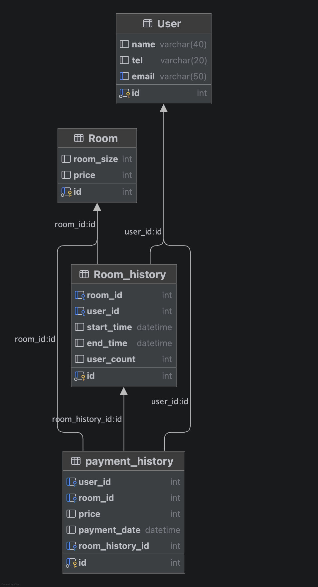

---

## ⚙️ 백엔드 설계

### 1. 레이어드 아키텍처

```
View (Swing UI)
    ↓ 호출
Service (비즈니스 로직)
    ↓ 호출
DAO (DB 접근)
    ↓ JDBC
MySQL DB
```

### 2. DAO 패턴

각 테이블별 인터페이스와 구현체를 분리하여 유지보수성을 높였습니다.

| 인터페이스 | 구현체 | 대상 테이블 |
|---|---|---|
| `UserDao` | `UserDaoImp` | User |
| `RoomDao` | `RoomDaolmp` | Room |
| `RoomHistoryDao` | `RoomHistoryDaolmp` | Room_history |
| `PaymentHistoryDao` | `PaymentHistoryDaoImp` | payment_history |

### 3. 싱글톤 & 팩토리 패턴

**DBUtil (싱글톤)**
- `DBUtil.getInstance()`로 단일 인스턴스만 유지하며, JDBC 드라이버 로딩을 최초 1회만 수행합니다.
- `close(AutoCloseable...)` 메서드로 Connection / PreparedStatement / ResultSet을 일괄 해제합니다.

**StudyCafeFactory**
- 각 DAO 객체를 `static final`로 한 번만 생성해 애플리케이션 전체에서 재사용합니다.
- `Service` 계층에서 직접 `new`를 사용하지 않고 팩토리를 통해 의존성을 주입받습니다.

### 4. 트랜잭션 처리

예약 등록·수정·취소 시 `Room_history`와 `payment_history` 테이블을 함께 조작하므로, `Connection`을 서비스 계층에서 직접 관리하여 원자성을 보장합니다.

```
예약 등록:  Room_history INSERT → payment_history INSERT → COMMIT (실패 시 ROLLBACK)
예약 수정:  Room_history UPDATE → payment_history UPDATE → COMMIT (실패 시 ROLLBACK)
예약 취소:  payment_history DELETE → Room_history DELETE → COMMIT (실패 시 ROLLBACK)
```

> DAO 메서드에 `Connection con`을 파라미터로 전달하여, DAO 내부에서 커넥션을 닫지 않고 서비스 계층에서 커밋/롤백 후 해제합니다.

### 5. 예외 처리 계층

비즈니스 예외를 목적별로 세분화하여 뷰 계층에서 메시지를 바로 출력할 수 있도록 설계했습니다.

| 예외 클래스 | 발생 시점 |
|---|---|
| `DuplicateException` | 이메일 중복 등록, 예약 시간 중복 |
| `CanNotFindException` | 존재하지 않는 유저·룸·예약 조회 |
| `InvalidTimeException` | 종료 시간이 시작 시간보다 앞인 경우 |
| `ReservationException` | 예약 등록·수정·취소 중 일반 오류 |

---

## 🔧 주요 기능 및 실행 화면

### 🔐 로그인

이메일을 입력해 로그인합니다. 존재하지 않는 이메일이면 예외 메시지를 출력합니다.

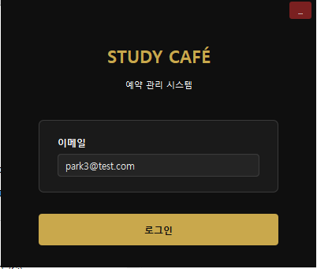

---

### 📅 회의실 예약 관리

로그인 후 메인 화면입니다. 내 예약 조회 / 예약 수정 / 예약 취소 / 회의실 예약 기능을 제공합니다.

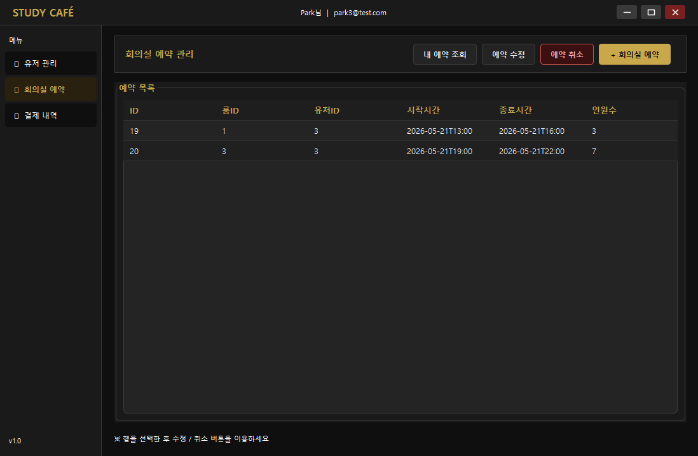

---

### 🏠 회의실 예약 - 룸 및 시간 선택

날짜를 선택하고 **룸 조회** 버튼을 누르면 예약 가능한 회의실 목록과 시간대가 표시됩니다.  
빨간색 시간대는 이미 예약된 시간이며, 선택 불가능합니다.

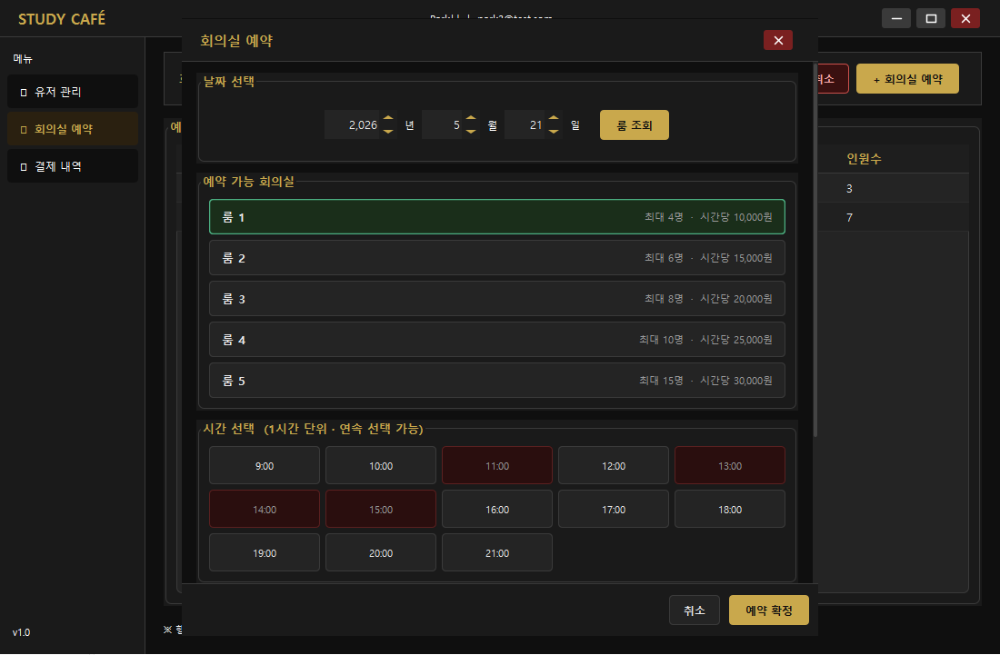

---

### 💰 예약 정보 확인 및 금액 계산

회의실과 시간을 선택하면 예약 정보와 예상 금액이 자동으로 계산됩니다.

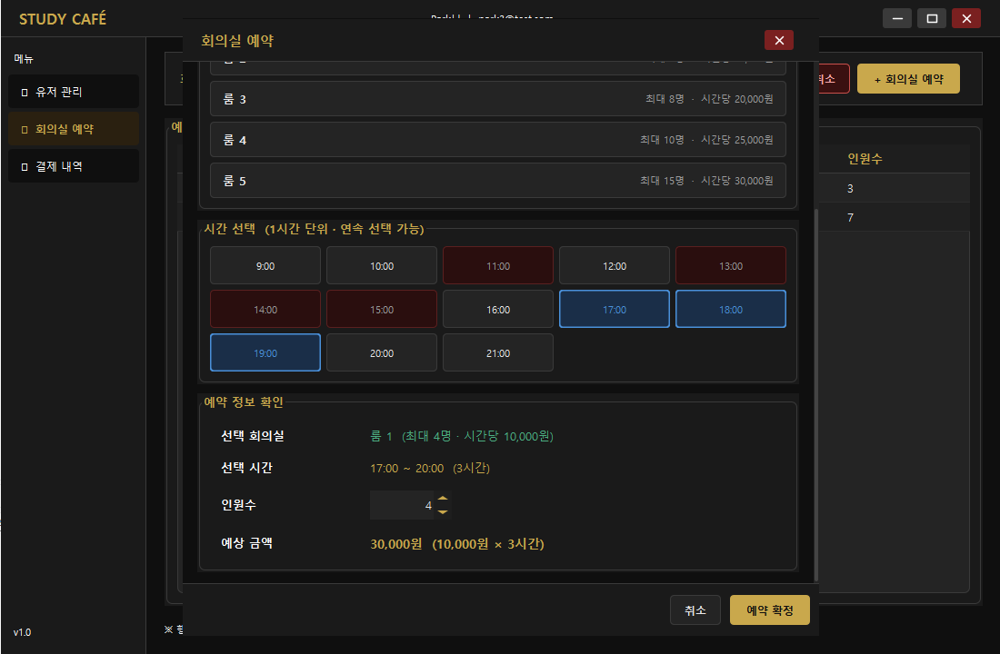

---

### ✅ 예약 완료 후 목록 조회

예약 확정 후 **내 예약 조회**를 누르면 등록된 예약 목록이 표시됩니다.

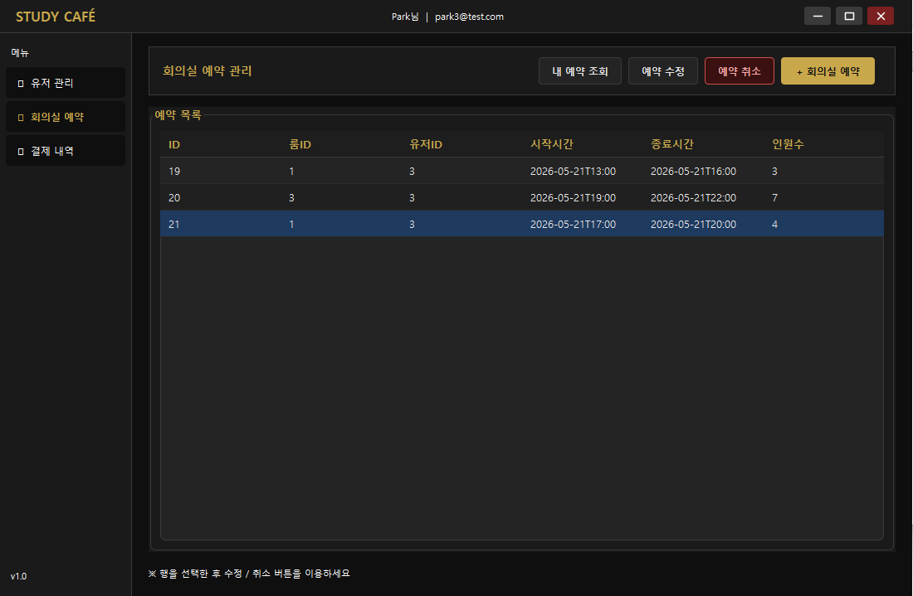

---

### 💳 결제 내역 조회

예약 등록 시 결제 내역이 자동 생성됩니다. 결제 금액·시간·룸 정보를 확인할 수 있습니다.

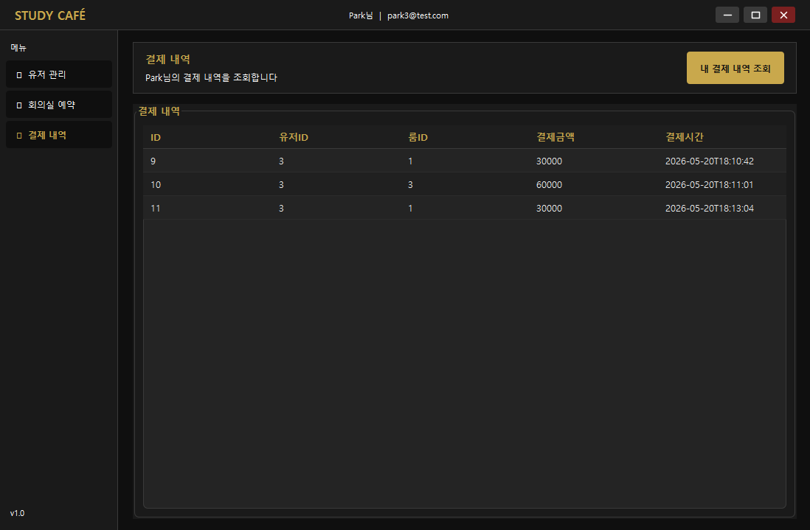

---

### ✏️ 예약 수정

기존 예약 시간은 **초록색**으로 표시되며, 연속된 시간대를 추가·제거해 수정할 수 있습니다.

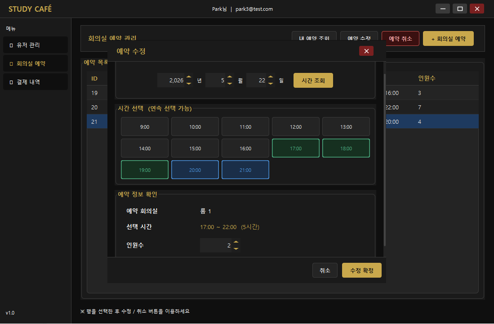

---

### ✅ 예약 수정 완료

수정 후 목록에 변경된 날짜·시간·인원수가 반영됩니다.

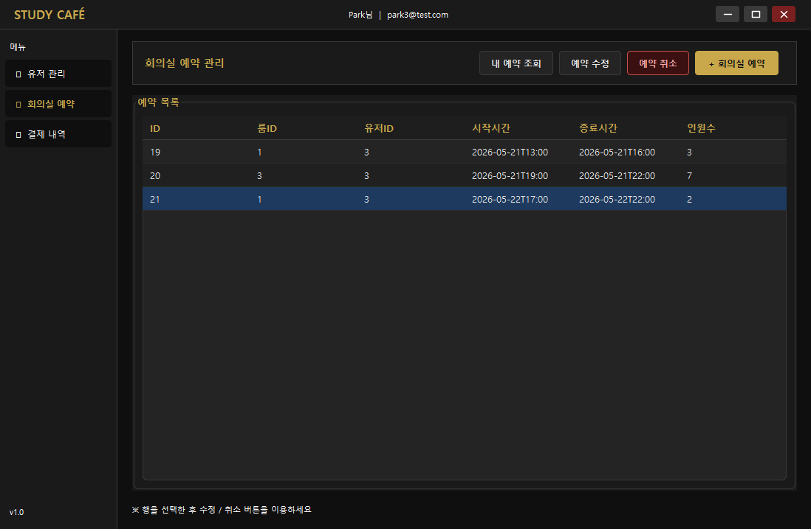

---

### 💳 결제 금액 자동 재계산

예약 수정 시 변경된 시간에 맞춰 결제 금액이 자동으로 업데이트됩니다 (30,000원 → 50,000원).

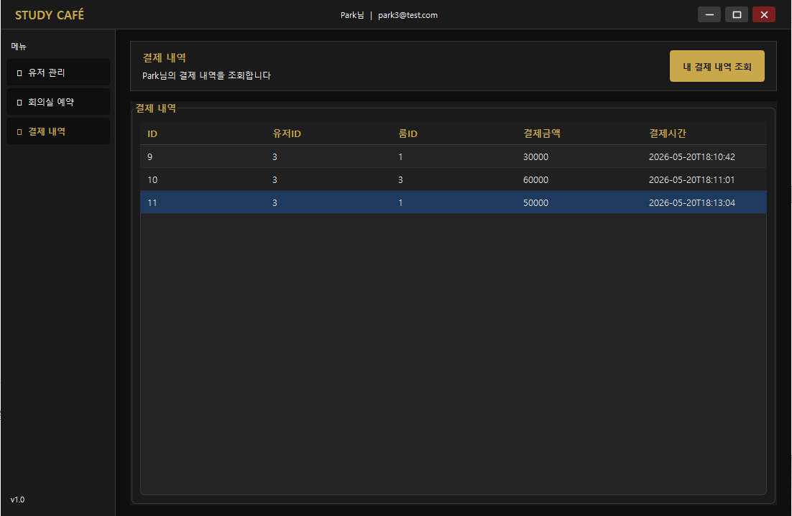

---

### ❌ 예약 취소

예약 취소 시 연관된 결제 내역도 함께 삭제됩니다 (트랜잭션 처리).

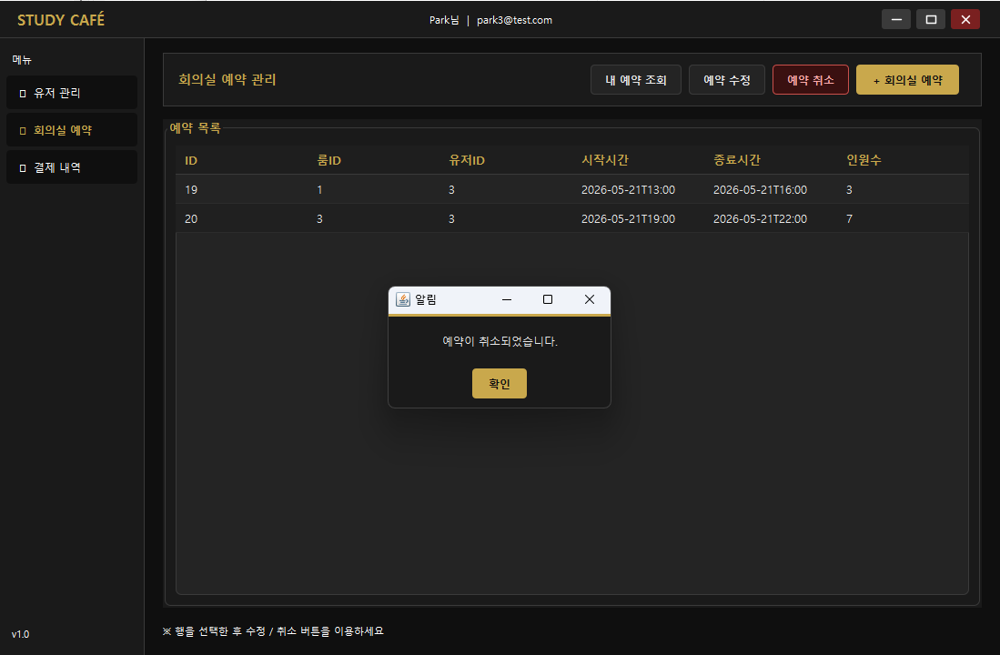

---

### 💳 예약 취소 후 결제 내역

취소된 예약의 결제 내역(ID: 11)이 목록에서 삭제된 것을 확인할 수 있습니다.

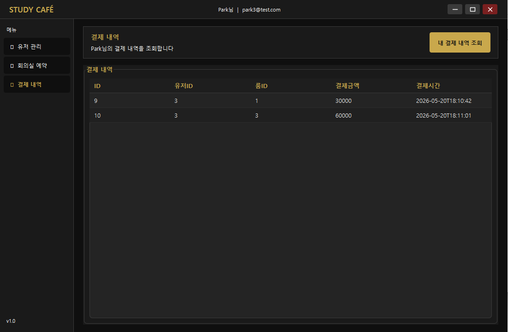

---

### 👤 유저 관리 - 전체 조회

등록된 전체 유저 목록을 조회합니다. 테이블 행 클릭 시 폼에 자동으로 정보가 채워집니다.

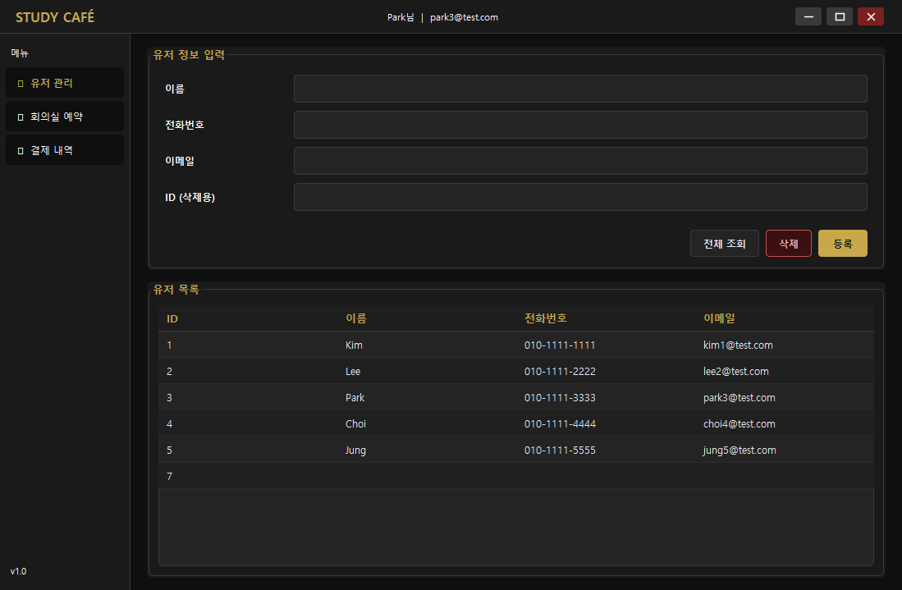

---

### 👤 유저 등록 - 정보 입력

이름, 전화번호, 이메일을 입력 후 **등록** 버튼을 클릭합니다.

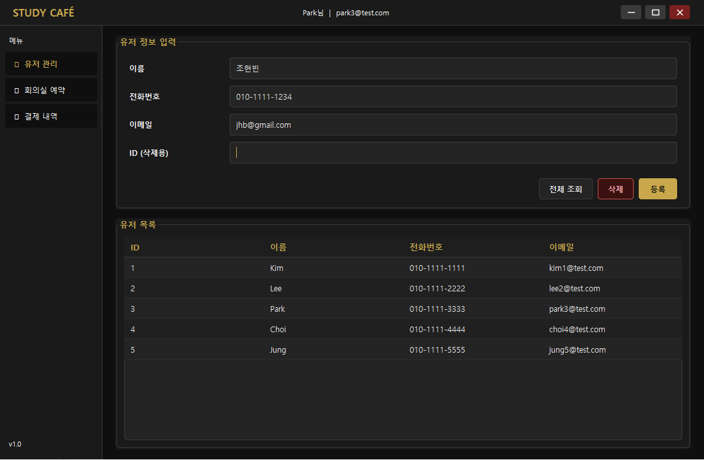

---

### ✅ 유저 등록 완료

등록 성공 알림과 함께 목록에 새 유저(조현빈)가 추가됩니다.

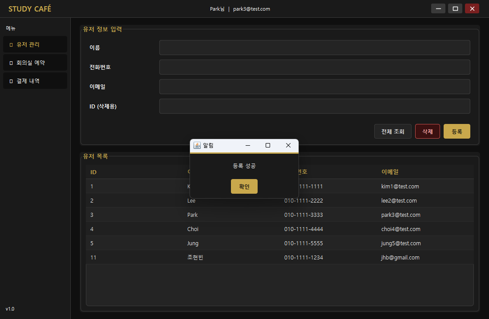

---

### 👤 유저 삭제 - 행 선택

테이블에서 삭제할 유저를 클릭하면 ID가 자동으로 입력됩니다.

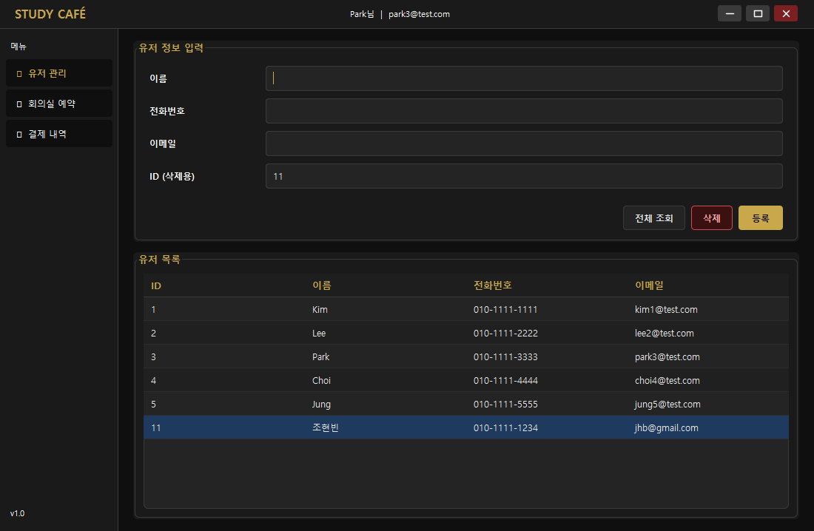

---

### ✅ 유저 삭제 완료

삭제 성공 알림과 함께 목록에서 해당 유저가 제거됩니다.

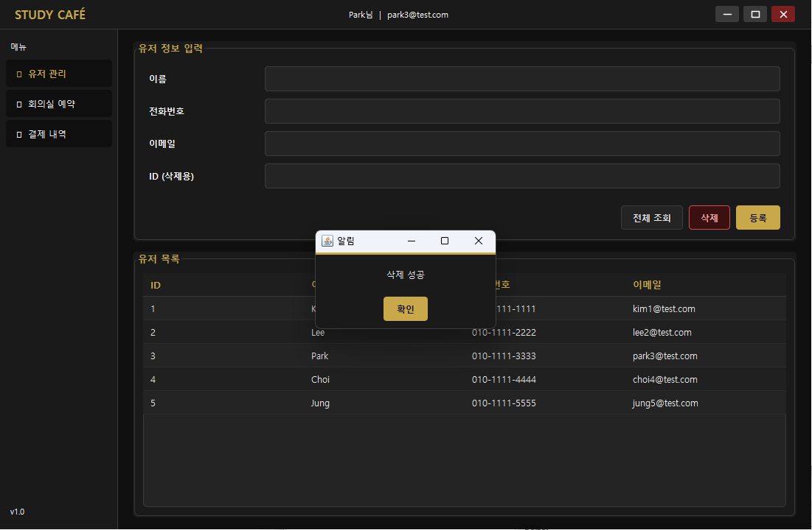

---

## 🚀 실행 방법

### 사전 요구사항
- Java 21 이상
- MySQL 8.0 이상
- Maven 3.x

### DB 설정

```sql
CREATE DATABASE studycafedb
  CHARACTER SET utf8mb4
  COLLATE utf8mb4_unicode_ci;

CREATE USER 'ureca'@'localhost' IDENTIFIED BY 'ureca';
GRANT ALL PRIVILEGES ON studycafedb.* TO 'ureca'@'localhost';
FLUSH PRIVILEGES;
```

```sql
USE studycafedb;

CREATE TABLE User (
    id    INT AUTO_INCREMENT PRIMARY KEY,
    name  VARCHAR(40) NOT NULL,
    tel   VARCHAR(20),
    email VARCHAR(50) UNIQUE NOT NULL
);

CREATE TABLE Room (
    id        INT AUTO_INCREMENT PRIMARY KEY,
    room_size INT NOT NULL,
    price     INT NOT NULL
);

CREATE TABLE Room_history (
    id         INT AUTO_INCREMENT PRIMARY KEY,
    room_id    INT NOT NULL,
    user_id    INT NOT NULL,
    start_time DATETIME NOT NULL,
    end_time   DATETIME NOT NULL,
    user_count INT NOT NULL,
    FOREIGN KEY (room_id) REFERENCES Room(id),
    FOREIGN KEY (user_id) REFERENCES User(id)
);

CREATE TABLE payment_history (
    id              INT AUTO_INCREMENT PRIMARY KEY,
    user_id         INT NOT NULL,
    room_id         INT NOT NULL,
    price           INT NOT NULL,
    payment_date    DATETIME NOT NULL,
    room_history_id INT NOT NULL,
    FOREIGN KEY (user_id)         REFERENCES User(id),
    FOREIGN KEY (room_id)         REFERENCES Room(id),
    FOREIGN KEY (room_history_id) REFERENCES Room_history(id)
);
```

### 빌드 및 실행

```bash
# 의존성 설치 및 빌드
mvn clean package

# 실행
java -jar target/studycafe-reservation-0.0.1-SNAPSHOT.jar
```

또는 IDE(Eclipse, IntelliJ)에서 `com.ureca.Main` 클래스를 직접 실행합니다.

---

## 🔗 기술 스택 요약

| 구분 | 기술 |
|------|------|
| 언어 | Java 21 |
| UI | Java Swing |
| DB | MySQL 8.0 |
| DB 연동 | JDBC (mysql-connector-j 8.0.33) |
| 빌드 | Maven |
| 패턴 | DAO / Service / Singleton / Factory |
| 트랜잭션 | JDBC 수동 트랜잭션 (`setAutoCommit(false)`) |
